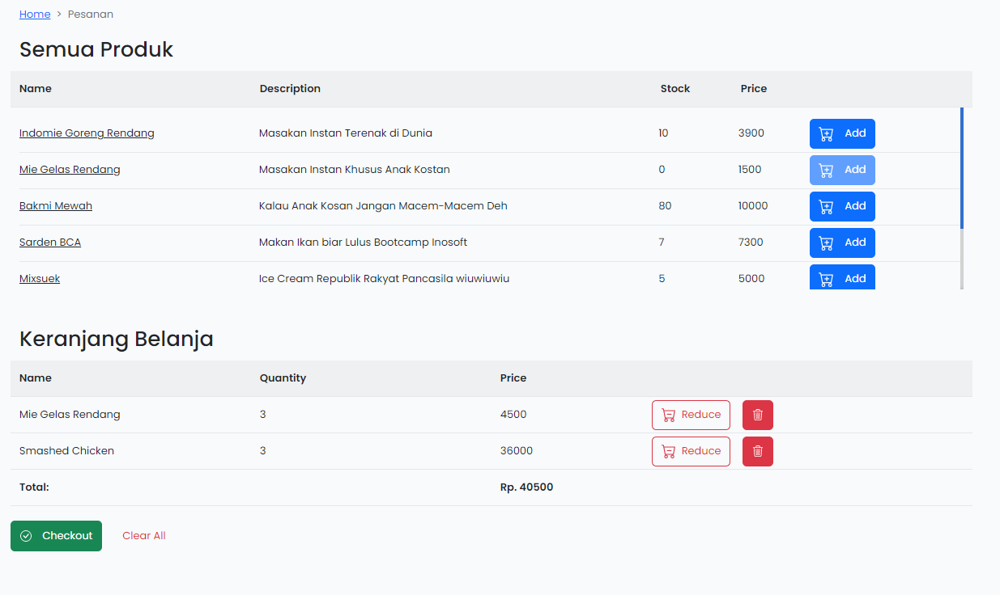
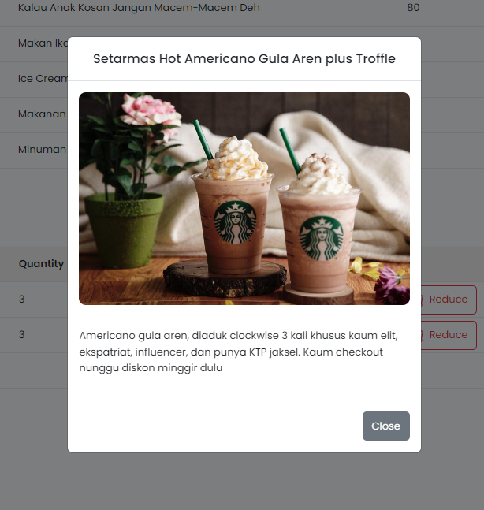

<p align="center"><a href="https://laravel.com" target="_blank"></a></p>
<p align="center"><a href="https://vuejs.org/" target="_blank"></a></p>

<p align="center">
<a href="https://travis-ci.org/laravel/framework"></a>
<a href="https://packagist.org/packages/laravel/framework"></a>
</p>

## Hosting Github Page  

[CLICK HERE](https://asrofilfachrulr.github.io/keranjang-belanja-vue/dist/) to go to the page

### Excuses  

Prior lack of my knowledge related to how to generate static file without any php because php cant be rendered by github page (tried many things also the mr. gpt told me so), I decided to generate static files with pure Vue only. So I simply (not that simple tho) copied the component files and placed it to new vue project. I done something this and that to figured out why bootstrap is freaking not working as with laravel-mix also some Vue, Jquery and other external scripts invocation in component' script flagged as error. Other than that, alhamdulillah the page successfully be rendered, overall functionality is almost same, though there ARE much still anomalies with bootstrap (why bootstrap..), so there are few differences in design.


## Final Look






## Component Layout Design


## Instructions

Clone the repository first and enter the directory

```bash
git clone https://github.com/asrofilfachrulr/keranjang-belanja-vue.git
cd keranjang-belanja-vue
```

Then install all dependencies

```bash
npm install
composer install
```

Last, compile the webpack and followed by enable the local server

```bash
npm run dev
php artisan serve
```

Normally web server will run at port 8000

```
localhost:8000
```

### Versions

| Tools             | version    |
| ----------------- | ---------- |
| PHP               | `7.4.29`   |
| Composer          | `2.5.1`    |
| Laravel/framework | `8.75`     |
| Node              | `v18.12.1` |
| NPM               | `8.19.2`   |
